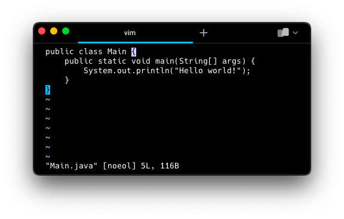

# Java Learning Project
This is a project I created to learn Java. It includes small files that demonstrate different aspects of the language, including control structures, data types, and object-oriented programming for personal use.

**WARNING:** _This project is not intended to be used as a reference for best practices. It probably includes errors. Use at your own risk._

## Ideas for Programs
* Hello World: A simple program that prints "Hello, world!" to the console. 
* Calculator: A program that prompts the user for two numbers and performs a mathematical operation on them (addition, subtraction, multiplication, or division). 
* Guessing Game: A game where the user tries to guess a randomly selected number between 1 and 100. 
* Bank Account: A program that simulates a bank account and allows the user to deposit, withdraw, and check their balance. 
* Shapes: A program that demonstrates inheritance and polymorphism by creating different types of shapes and calculating their areas.

## How to Use
1. Clone or download the repository to your local machine. 
2. Open the project in your favorite Java IDE. 
3. Run the individual programs by right-clicking on the file and selecting "Run" or by clicking the
4. "Run" button in the IDE.

## Contributing
If you would like to contribute to this project, feel free to submit a pull request with your changes. I am always open to feedback and suggestions for improvements.